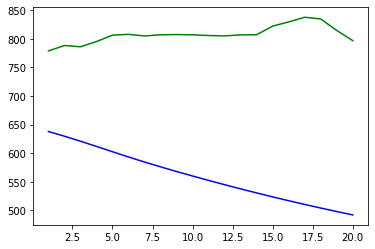

# Google Stock Price Prediction

a project for predicting Google stock prices using deep learning techniques. The project involves data preprocessing, training a Long Short-Term Memory (LSTM) model, and visualizing the predictions against actual stock prices.

## Table of Contents

- [Introduction](#introduction)
- [Dataset](#dataset)
- [Model](#model)
- [Results](#results)
- [Contributing](#contributing)

## Introduction

The goal of this project is to predict the future stock prices of Google using historical stock price data. This is achieved by implementing an LSTM model. LSTMs are well-suited for time series prediction problems due to their ability to remember previous data points.

## Dataset

The dataset used for this project consists of [Google's historical stock prices](https://www.kaggle.com/datasets/medharawat/google-stock-price?select=Google_Stock_Price_Test.csv). The training data (`Google_Stock_Price_Train.csv`) and testing data (`Google_Stock_Price_Test.csv`) can be found [here](https://www.kaggle.com/datasets/medharawat/google-stock-price?select=Google_Stock_Price_Test.csv).

### Example:

| Date | Open | High | Low | Close | High |
| --- | --- | --- | --- | --- | --- |
| 1/3/2012 | 325.25 | 332.83 | 324.97 | 663.59 | 7,380,500 |

## Model

The model used in this project is an LSTM Architecture. The model is trained to predict the opening price of Google's stock based on the previous 60 days of data.

Model Architecture
- Input layer with shape (60, 1)
- Three LSTM layers with 50 units each, ReLU activation, and dropout of 0.2
- Dense output layer with 1 unit and ReLU activation
- Optimizer: Adam
- Loss function: Mean Squared Error (MSE)

> [!TIP]
> you could change the number of the days as you like.

> [!WARNING]
> Don't forget to change the input shape of both the model and the `x,y`.

## Results

The Model was trained in google colab and only an one experiment was made for academic reason. Even though the model shows little loss but it wasn't nearly as equal to the actual data.

- batch: 50
- loss: `9.3760e-04`
- validation loss: `0.0543`

In the graph above:
- **Blue line** represents the predicted stock prices.
- **Green line** represents the actual stock prices.

> [!CAUTION]
> Don't use it for real trading.

## Contributing

Contributions are welcome! If you have any suggestions or improvements, feel free to open an issue or submit a pull request.

> [!NOTE]
> I forgot to make requirements.txt file since I ran it in google colab environmet.
